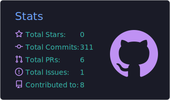
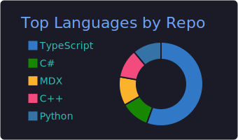
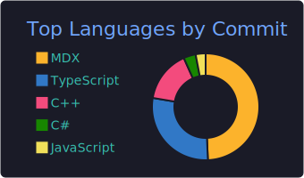
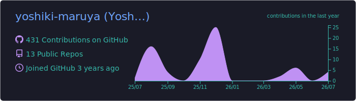

# Yoshiki Maruya

 

## Tech Stack

**Languages**

**Frameworks & Libraries**

**Cloud & Infrastructure**

**Tools**

 

## GitHub Stats

<table>
  <tr>
    <td align="center" width="33%"></td>
    <td align="center" width="33%"></td>
    <td align="center" width="33%"></td>
  </tr>
  <tr>
    <td align="center" colspan="3"></td>
  </tr>
</table>

Stats above are generated by a scheduled <a href="./.github/workflows/profile-cards.yml">GitHub Action</a> and committed to this repo, so they don't depend on a third-party server staying online.
